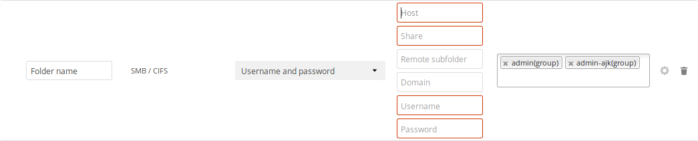
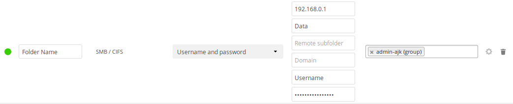

# Set Up ownCloud pada Share AJK

## requirement:
1. Linux
2. Apache
3. MySQL
4. PHP


## Step:
1. Owncloud Installation
    * Ubuntu 16.04
     
        Download their release key using the curl command and import it with the apt-key utility with the add command:
        ```
        sudo curl https://download.owncloud.org/download/repositories/stable/Ubuntu_16.04/Release.key | sudo apt-key add -
        ```
        After adding a new source, use the apt-get utility and the update command to make apt aware of the change:
        ```
        sudo apt-get update
        ```
        Finally, perform the installation of ownCloud using the apt-get utility and the install command:
        ```
        sudo apt-get install owncloud
        ```
    * Below Ubuntu 16.40
        
        <!-- Karena di official owncloud hanya menyediakan packages linux untuk Ubuntu 16.04 keatas, jika menggunakan versi dibawahnya maka bisa menggunakan cara lain yakni download tarball dari website owncloud:
        https://owncloud.org/download/ -->

        Since ownCloud only provides Linux packages for Ubuntu 16.04 and above, if you're using a lower version you can use other method which is download the tarball from ownCloud Website:
        https://owncloud.org/download/

        Extract the downloaded tarball and put it to the directory for deployment, it's usually in /var/www/html

        <!-- tarball yang sudah di download tadi selanjutnya di ekstrak di directory tempat deploy (/var/www) -->

2. MySQL Database Configuration
    
    To get started, log into MySQL with the administrative account:

    ``` 
    mysql -u root -p 
    ```
    Owncloud need separate database to store data, we decide to call the database `owncloud`
    ```
    mysql> CREATE DATABASE owncloud;
    ```
    We also need separate user for better management and security, here we decide to make user `owncloud`
    ```
    mysql> GRANT ALL ON owncloud.* to 'owncloud'@'localhost' IDENTIFIED BY 'set_database_password';
    ```
    To ensure that recent privileges assignment are running perform a flush-privileges
    ```
    mysql> FLUSH PRIVILEGES;
    ```
    Then exit from mysql
    ```
    mysql> exit
    ```
3. ownCloud Configuration
    To access the ownCloud web interface, open a web browser and navigate to the following address:
    ```
    https://server_domain_or_IP/owncloud
    ```

4. Set Samba on ownCloud

    https://doc.owncloud.org/server/8.2/admin_manual/configuration_files/external_storage/smb.html

5. Define trusted proxy

    https://doc.owncloud.org/server/8.2/admin_manual/configuration_server/reverse_proxy_configuration.html

6. Adding Directory for File Sharing
    * Log in to ownCloud web interface as an administrator, then go to Settings, it's on the top right of the dropdown menu.
    * Then go to Storage, it's on the left side navigation of the ownCloud web
    * You can add a new directory by:

    

    since AJK uses SMB as a network file sharing protocol, we choose SMB / CIFS on the dropdown menu
    * After adding a new storage, we still have to fill in some information

    
    
    - Choose Username and password as the authentication method
    - Fill _Host_ with IP address of the server used for the file sharing
    - Fill _Share_ with the exact same name of the folder you want to share
    - You can leave _Remote subfolder_ and _Domain_ blank
    - Fill _Username_ and _Password_ with the username and password used for accessing the file sharing server
    - Add some specific group if you want to share it with only specific people or you can leave it blank so that the folder will be available for all users

    

    And you are done.


## References
    * https://www.digitalocean.com/community/tutorials/how-to-install-and-configure-owncloud-on-ubuntu-16-04
    * https://doc.owncloud.org/server/8.2/admin_manual/configuration_files/external_storage/smb.html
    * https://doc.owncloud.org/server/8.2/admin_manual/configuration_server/reverse_proxy_configuration.html

